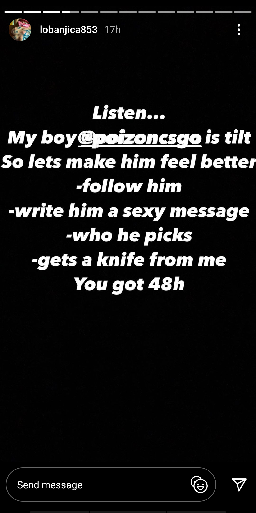
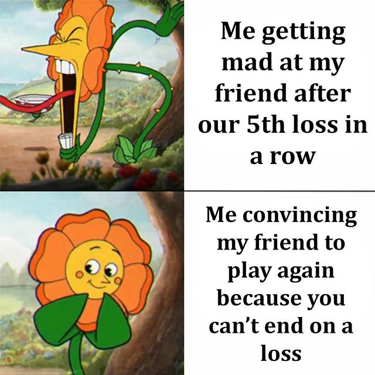
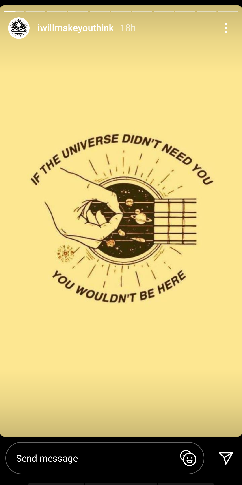
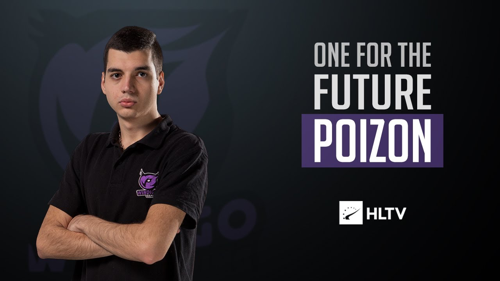
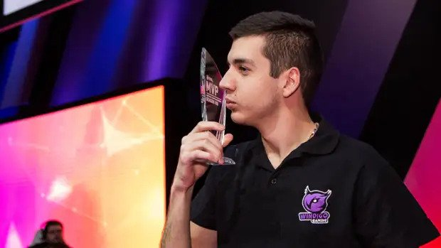

<h1 align="center"><b>Comeback :fire: </b></h1> 

Coming from love with [Loba](https://www.instagram.com/lobanjica853/) :gift_heart:

 

> *"The comeback is always greater than the setback"*

I always had the habit of tilting after losing matches >> This image below is [ME](https://www.instagram.com/at_1147/) xd after every match

 

 

 in short I always wanted to win :fire: and hated Losing :rage1:

But later I realised that getting tilted is only bad for me 

### Some KeyPoints to avoid getting tilted :D

- Getting tilted and being disappointed in yourself will only reduce your producitivity
  
- UnderPromise , Overdeliver
- Practice makes Progress and eventually Perfect Don't Burnout   :robot:

- Losing a Battle Does'nt mean you lost the WAR
    

- Enjoy your Victory , People say kiss :couplekiss: your <b>GIRL</b> like Poizon kisses his Trophy hehe
  

    
- Be Happy :)
   

- The harder the Battle :triumph: the Sweeter :birthday: the Victory
- And Always remember the <b>Comeback</b> is greater than the setback

## *Hope you have a great Day ahead* :trophy::1st_place_medal:

